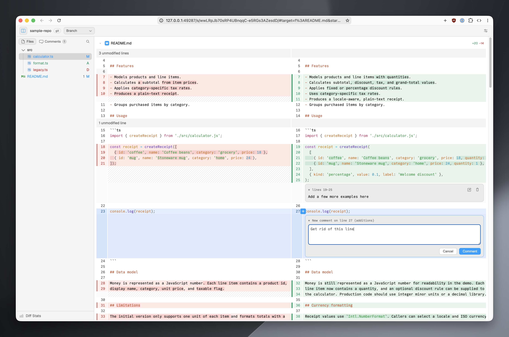

# diffs-pane

Live Git and jj diffs for humans and coding agents.

`dp` watches a working tree, prints an authenticated localhost URL, and keeps the
browser view current as files change. Humans can leave inline comments; agents
read them with `dp reviews` and clear addressed feedback with `dp resolve`.



- One terminal-independent CLI
- One per-user daemon and one shared session per working tree
- Git and jj support (jj takes precedence in colocated repositories)
- React UI powered by [@pierre/diffs](https://diffs.com/docs) and
  [@pierre/trees](https://trees.software/docs)
- Node.js 24+
- pnpm 11.3+

## Installation

```sh
pnpm add --global diffs-pane
```

Or build the repository locally:

```sh
git clone https://github.com/itsmingjie/diffs-pane.git
cd diffs-pane
pnpm install
pnpm run build
pnpm link --global
```

## Quick start

From any Git or jj working tree:

```sh
dp watch
# http://127.0.0.1:53707/s/<capability-token>/
```

Open the URL once. The viewer updates automatically; there is no need to rerun
`dp` after edits. The daemon uses port `34337` unless another process has
claimed it.

Choose a starting diff source when needed:

```sh
dp watch branch
dp watch unstaged
dp watch turn
```

## Human-agent review loop

1. The agent runs `dp watch` and shares the URL.
2. The human selects lines and leaves comments in the viewer.
3. The agent reads feedback:

   ```sh
   dp reviews
   # or structured output with comment ids and deep links
   dp reviews --json
   ```

4. The agent fixes the code and resolves only the comments it addressed:

   ```sh
   dp resolve <comment-id> [<comment-id>...]
   ```

Review export is non-destructive and repeatable. Comments re-anchor when their
saved text has one unambiguous match; otherwise they remain available as
**outdated** comments with the original diff excerpt.

## Commands

| Command | Purpose |
| --- | --- |
| `dp watch [branch\|unstaged\|turn]` | Start or reuse a session and print its URL |
| `dp reviews [--json]` | Export review comments for the current working tree |
| `dp resolve <id>...` | Delete addressed review comments |
| `dp resolve --all` | Delete every review comment for the working tree |
| `dp turn start ...` | Capture the baseline for the Last turn diff |
| `dp turn end ...` | Finish an agent turn |
| `dp status [--json]` | List daemon and session state |
| `dp stop [options]` | Release a session lease |

### Watch options

```text
dp watch [branch|unstaged|turn] \
  [--no-watch] \
  [--root <path>] \
  [--base <revision>] \
  [--owner <integration-name>]
```

The filter defaults to `branch`; bare `dp` is equivalent to `dp watch branch`.
`--no-watch` opens a static session without filesystem updates. `--root`
defaults to the current directory. `--base` overrides the branch base. `--owner`
creates an opaque integration lease; a session remains alive until its final
owner releases it.

### Turn tracking

```sh
dp turn start --session <session-id> --turn <turn-id> --agent <name>
# make changes
dp turn end --session <session-id> --turn <turn-id>
```

`turn start` records a read-only working-tree baseline. Duplicate starts for the
same turn are idempotent. The viewer’s **Last turn** source compares the current
working tree with that baseline, including files that were already dirty.

### Stopping sessions

```sh
dp stop                              # current working tree
dp stop --root /path/to/repository
dp stop --owner <name> --all         # release one integration everywhere
dp stop --all                        # stop every session
```

The daemon exits after its final session stops.

## Viewer

- Live patch refresh over SSE
- Split and unified layouts, line wrapping, syntax highlighting, and sticky
  per-file headers
- Dense, searchable file tree with status and line statistics
- Expandable Diff Stats panel with file, addition, deletion, and line totals
- Collapsible desktop sidebar and an overlay sidebar for narrow coding panes
- Automatic unified layout below 768px, with Split restored on wider panes
- Comments grouped by file with direct line navigation
- Per-file collapsing and line-range permalinks
- Geist interface, Commit Mono code, and the same Pierre light/dark palette used by DiffsHub

Selecting lines updates the URL:

```text
<session-url>#target=f:<path>&start=A<line>[&end=A<line>]
```

`A` addresses the additions side and `D` the deletions side. Live
`dp reviews --json` output includes the corresponding URL for each comment.

## Diff sources

| Source | Git | jj |
| --- | --- | --- |
| **Branch** | Merge base of `HEAD` and the base revision through the full index and working tree, including untracked files | `fork_point(trunk() \| @)` through the current working copy |
| **Unstaged** | Working tree versus index, including untracked-but-unignored files | Current working-copy change (`@`), labeled **Working copy** |
| **Last turn** | Snapshot tree captured by `dp turn start` versus the current working tree | Working-copy commit captured at turn start versus current `@` |

Additions, deletions, renames, mode changes, binary files, unusual paths, and
empty diffs are supported. diffs-pane never mutates the index or working tree
and never runs automatic jj recovery commands.

## Agent integration

The packaged [Agent Skill](skills/diffs-pane/SKILL.md) teaches coding harnesses
the complete watch → review → fix → resolve workflow.

A ready-to-use Pi lifecycle extension is available at
[`extension/pi/dp-turn.ts`](extension/pi/dp-turn.ts).

## Security

- The daemon binds only to `127.0.0.1` and rejects non-loopback peers,
  unexpected Host headers, cross-origin mutations, and oversized requests.
- Browser URLs contain unguessable per-session capability tokens.
- CLI control requests use a separate owner-only secret.
- Sessions, turn baselines, and reviews are written atomically to the platform
  user-state directory, never to the reviewed repository.

Treat a session URL like a password while its session is active.

## Development

```sh
pnpm run dev:sample       # build and open a disposable real Git sample
pnpm run dev:sample:stop  # stop its lease and remove the sample
pnpm run typecheck
pnpm run lint
pnpm run format
pnpm test
pnpm run build
```

The sample lives at `.tmp/sample-repo` by default and exercises the real CLI,
daemon, Git backend, watcher, SSE stream, and UI. Edit its files to test live
refresh, or rerun `pnpm run dev:sample` to rebuild and reset it. Set
`DIFFS_PANE_SAMPLE_ROOT=/absolute/path` to use another location; the script
refuses to replace directories it did not create.

### Environment variables

| Variable | Purpose |
| --- | --- |
| `DIFFS_PANE_STATE_DIR` | Override the platform user-state directory |
| `DIFFS_PANE_MAX_PATCH_BYTES` | Set the patch-size limit (default: 20 MB) |
| `DIFFS_PANE_SAMPLE_ROOT` | Override the disposable development sample path |

## License

[Apache-2.0](LICENSE). The bundled [Geist](ui/fonts/Geist-LICENSE.txt) and
[Commit Mono](ui/fonts/CommitMono-LICENSE.txt) fonts are licensed under the SIL
Open Font License; Radix Icons is MIT-licensed.
